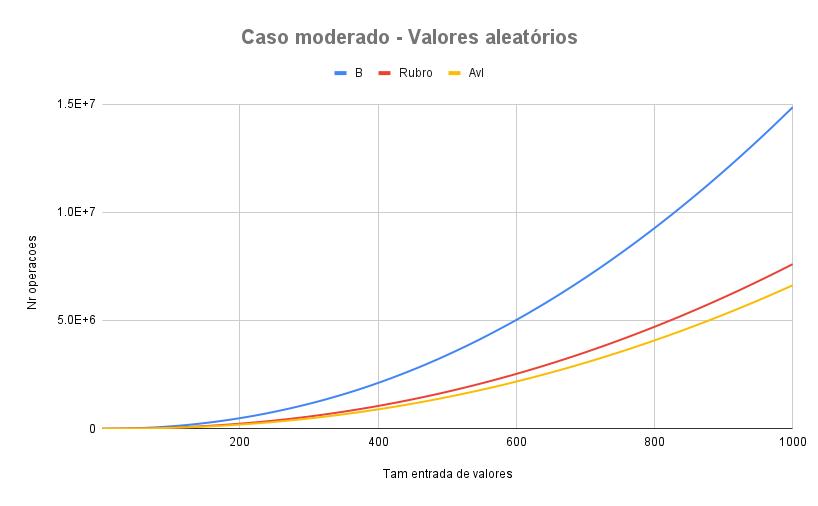
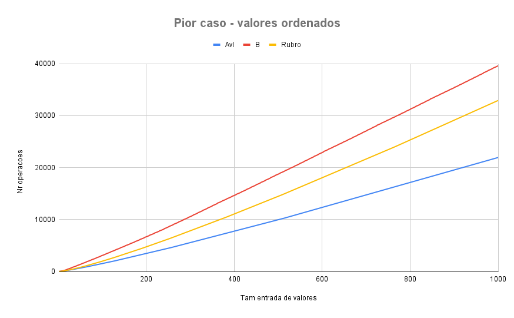

## Descricão
Trabalho realizado para disciplina de Projetos de Arquivos. Para analisar o desempenho de estruturas de arvores


### Alunos: 

- Bruna Lopes
- Victor Saramento

## Problema:

O objetivo deste trabalho consiste em analisar a complexidade algorítmica das operações de adição de nós e balanceamento em árvores:
1 - AVL
2 - rubro-negra 
3 - B. 

A análise deve ser realizada considerando a geração de um conjunto de dados (registros) com tamanho variando entre 1 e 1000. 

Os registros devem ser geradas prevendo o pior caso (chaves ordenadas crescente ou decrescente) e caso médio (chaves aleatórias). Para geração das chaves aleatórias, sugere-se o uso da função rand e srand em C considerando um tamanho de amostra de 10 conjuntos para validade estatística.

O resultado final do experimento deve ser exibido em DOIS gráficos de linha (um para o pior caso e outro para o caso médio), onde o eixo X representa o tamanho dos conjuntos de dados (1 a 1000) e o eixo Y representa o esforço computacional das operações (adição de chaves e balanceamento). Cada gráfico deve apresentar 3 linhas, as quais representam as respectivas operações para cada estrutura de dados avaliada.


## Executando 

```bash
gcc -Wall main.c arvoreAvl.c arvoreB.c rubro.c -o output
./output
```

## Plotando os graficos

Apos a execução, baixe os arquivos csv e gere os graficos via excel ou google sheets

## Resultados Obtidos 


Os resultados obtidos da análise de iterações realizadas nas operações de inserção por tamanho de conjunto dados, das árvores AVL B e Rubro Negro são apresentados nos dois graficos abaixo.

O primeiro apresenta o resultados de iterações com números ordenados. A ordem utilizada na árvore B para obtenção dos resultados foi 10 em ambos os cenários.
No segundo gráfico são apresentados os resultados de iterações com números aleatórios. Pode-se observar que a árvore B apresentou o pior desempenho, tanto no pior caso quanto no caso moderado, tendo o maior número de operações de adição e balanceamento.
A arvore Rubro-Negro apresentou desempenho relativamente próximo ao observado na arvore AVL que apresentou o melhor desempenho. O que foi inesperado para nos já que a teoria nos diz que a arvore Rubro-Negro possui maior rapidez nas operacoes de inserçao quando comparadas com a velocidade de insercao na AVL, isso porque possui menos rotacoes de balanceamento.




